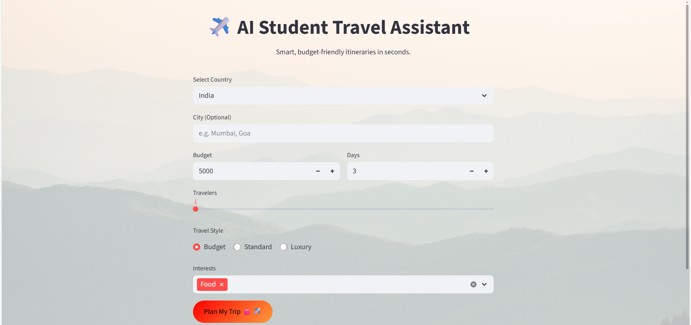
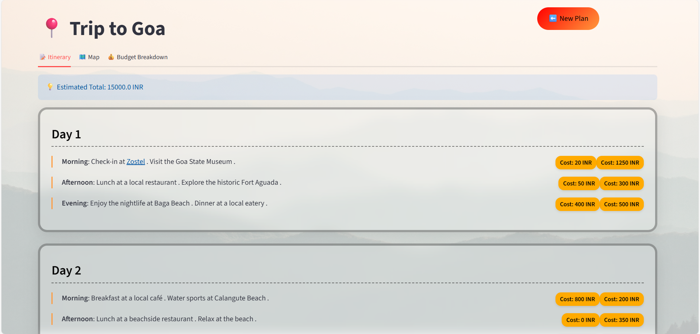
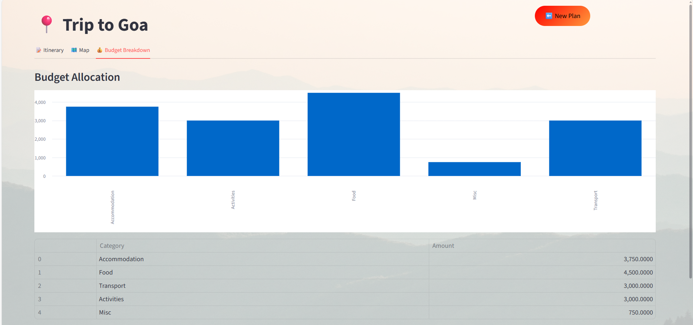
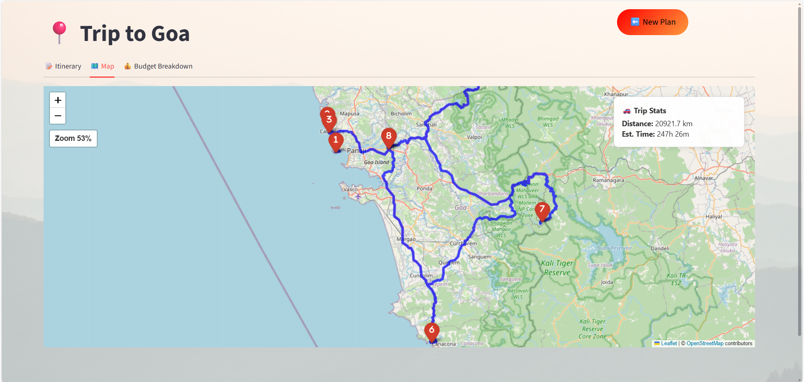

# 🧳 AI Travel Planner For Students 

An AI-powered platform that helps students plan budget-friendly, personalized, and efficient trips using real-time location data, maps, and generative AI.

---

## 🌍 Overview

AI Travel Planner is a Streamlit-based travel planning app that uses AI (Groq LLM) to generate smart, student-friendly itineraries.

Enter your destination, travel days, budget, type of travel, and interests — the app generates:

- Detailed day-wise itinerary  
- Morning / Afternoon / Evening segments  
- Cost-tag breakdown matching your total budget  
- Student-friendly hotel suggestions  
- List of important places  
- Interactive route map with markers  

All generated dynamically using AI + Folium (OpenStreetMap).

---

## 🚀 Features

### ✨ AI Features
- Generates complete student itineraries
- Validates budget mathematically (sum of cost tags)
- Produces HTML output with styled cards, segments, and tables

### 🗺 Interactive Maps 
- Uses Folium + OpenStreetMap
- Auto-geocodes each location using Nominatim (OSM)
- Draws routes between itinerary locations using OSRM
- Adds markers automatically
- Displays distance & estimated travel time

### 💰 Budget Tools
- Intelligent category split (stay/food/transport/activities/misc)
- Adjusts based on interests (adventure, food, culture)
- Shows bar chart + table

### 🎨 Custom UI
- Modern glass-UI theme
- Animated buttons
- Styled itinerary cards
- Responsive layout

---

## 📁 Project Structure
<pre> ```text AI Travel Planner/ ├─ utils/ │ ├─ itinerary_ai.py │ ├─ maps.py │ ├─ travel_utils.py ├─ styles.css ├─ .streamlit/ │ └─ secrets.toml ├─ .env ├─ .gitignore ├─ app.py ├─ requirements.txt └─ README.md ``` </pre>
---

## 🖼️ Screenshots

### 🏠 Home / Input Page


---

### 🤖 AI Generated Itinerary


---

### 💸 Budget Summary


---

### 🗺️ Map View 



